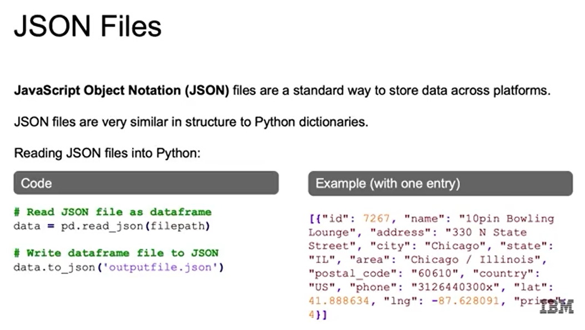
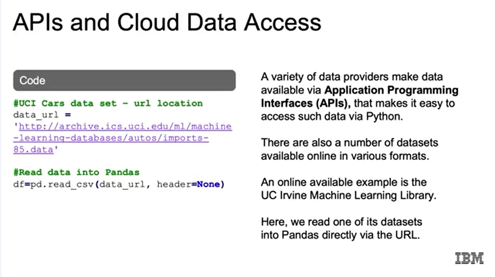

# 1. Retrieving Data
## Reading CSV Files:

- Định dạng “Comma Separated Values”.

- Đọc với pd.read_csv("file.csv").

- Có thể chỉ định sep, header, names, na_values…
## Reading JSON Files:

- Định dạng “JavaScript Object Notation”, giống dict trong Python.

- Đọc với pd.read_json("file.json"), có nhiều orient khác nhau (records, split, index…).

- Ghi ra JSON bằng df.to_json("file.json").
# 2. Reading in Database Files
## Reading SQL Data

- SQL = Structured Query Language, dùng cho CSDL quan hệ có schema cố định.

- Ví dụ: MySQL, PostgreSQL, SQL Server, Oracle, Redshift, IBM Db2.

- Dùng thư viện sqlite3, SQLAlchemy, psycopg2, ibm_db để kết nối.

- Quy trình: tạo kết nối → viết query (SELECT …) → đọc vào Pandas bằng pd.read_sql(query, conn).
## Reading NOSQL Data 

- Không quan hệ, linh hoạt hơn, thường lưu dữ liệu dạng JSON.

- Ví dụ: Document DB (MongoDB), Graph DB (mạng xã hội), Wide-column DB (Cassandra).

- Python: dùng pymongo.MongoClient để kết nối → chọn database → chọn collection → find(query) → đưa kết quả vào Pandas bằng pd.DataFrame(list(cursor)).
## APIs, and the Cloud

- Có thể truy cập dữ liệu từ dịch vụ như Twitter API, Amazon, hoặc dataset online (UC Irvine ML repo, v.v.).

- Thường chỉ cần URL → dùng pd.read_csv(url) để tải trực tiếp.
# 3. Data Cleaning
## Tầm quan trọng của làm sạch dữ liệu:
- "Garbage in, garbage out": dữ liệu bẩn → mô hình sai.

- Nhãn (labels) phải chính xác, đặc trưng (features) phải được ghi đúng.

- Nếu dữ liệu không phản ánh đúng thế giới thực, mô hình sẽ học sai.
## Vấn đề thường gặp:
- Thiếu dữ liệu → không đủ để huấn luyện.

- Quá nhiều dữ liệu rải rác nhiều nơi → khó quản lý, cần chuẩn hóa.

- Dữ liệu kém chất lượng (bad data) → khó ứng dụng ML, AI.
## Dữ liệu bẩn thường xuất hiện dưới dạng:
- Bị trùng lặp (duplicate) → làm sai lệch trọng số quan sát.

- Văn bản không nhất quán, lỗi chính tả, viết hoa/thường khác nhau.

- Thiếu dữ liệu (missing values) ở các cột quan trọng.

- Ngoại lệ (outliers) → làm lệch phân phối, gây nhiễu.

- Vấn đề từ nhiều nguồn dữ liệu khác nhau → dễ gây mismatch.
## Xử lý dữ liệu trùng lặp:
- Giữ lại nếu phản ánh thực tế (ví dụ: hoa Iris có thông số giống hệt).

- Loại bỏ nếu không cần thiết (ví dụ: ảnh bị lặp trong dataset hình ảnh).