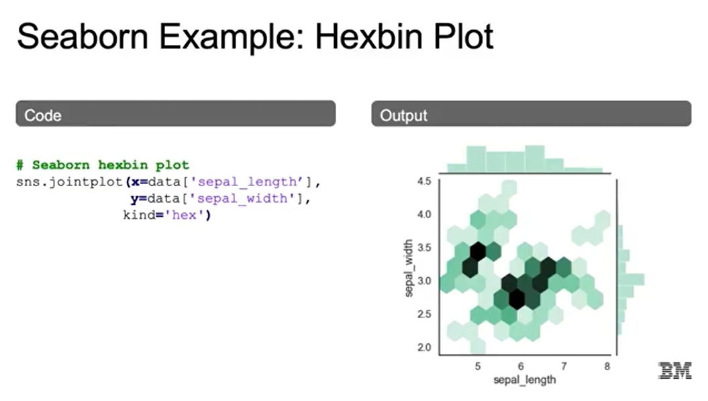
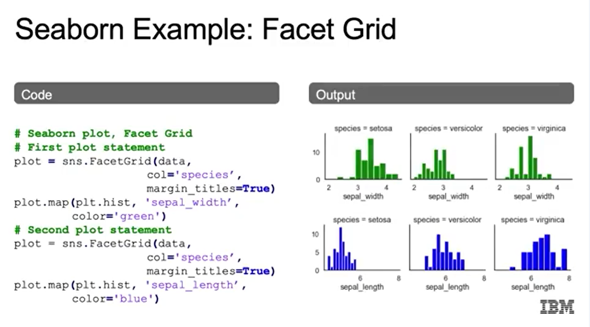
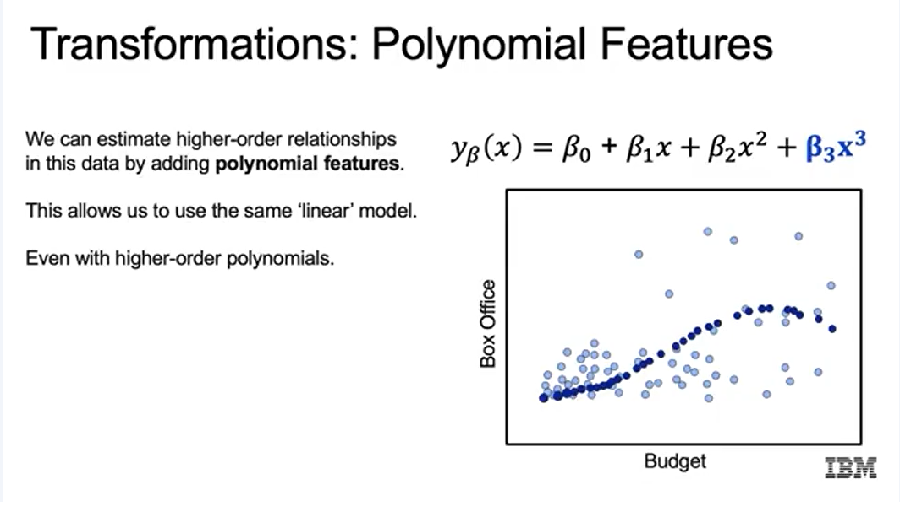
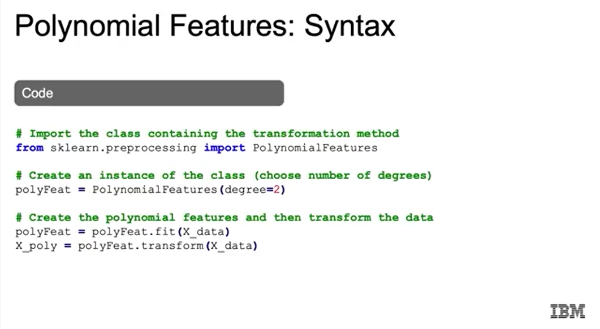

# 1. Exploratory Data Analysis
## Thư viện trực quan hóa dữ liệu trong Python::
- Matplotlib: cơ bản, linh hoạt, mạnh mẽ.

- Pandas: wrapper tiện lợi của Matplotlib, nhanh nhưng ít tùy biến.

- Seaborn: xây trên Matplotlib, đẹp, có nhiều biểu đồ thống kê tiện dụng (pairplot, jointplot, facet grid...).
## Các loại biểu đồ:
- Scatter plot: thể hiện quan hệ giữa 2 biến, có thể thêm màu/nhãn.

- Histogram: phân bố của 1 biến.

- Bar plot: so sánh giá trị theo nhãn.

- Line plot (qua Pandas).

- Pair plot (Seaborn): quan hệ giữa nhiều biến + histogram.

- Hexbin plot: mật độ điểm dữ liệu.

- Facet grid: tách biểu đồ theo từng nhóm (species).

# 2. Feature Engineering and Variable Transformation
## Hàm tuyến tính cơ bản:

## Polynominal Features:

## Syntax:

## Variable Selection:
- Chọn các đặc trưng để đưa vào mô hình. Trước đó có thể cần biến đổi (log, polynomial), encoding (mã hóa biến phân loại) và scaling (chuẩn hóa thang đo).
## Encoding cho biến phân loại:
- Binary Encoding: cho biến 2 giá trị (True/False → 0/1).

- One-Hot Encoding: cho biến nhiều giá trị (mỗi giá trị → 1 cột mới, đánh dấu 0/1).

- Ordinal Encoding: cho biến có thứ bậc (low=1, medium=2, high=3).
