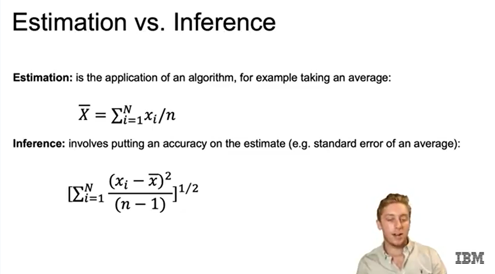

# 1. Estimation and Inference
## Công thức:
- Estimation (ước lượng): tính giá trị tham số từ mẫu, ví dụ: trung bình = tổng giá trị / số mẫu.

- Inference (suy luận thống kê): không chỉ ước lượng mà còn tìm hiểu phân phối tổng thể, độ tin cậy, sai số chuẩn, khoảng tin cậy.

# 2. Hypothesis Testing
- Giả thuyết (Hypothesis) là một phát biểu về tham số của tổng thể. Thông thường có hai giả thuyết: giả thuyết không (null hypothesis) và giả thuyết đối (alternative hypothesis).

- Kiểm định giả thuyết (Hypothesis test) đưa ra một quy tắc để quyết định: với những giá trị nào của thống kê kiểm định thì chấp nhận giả thuyết không, và với những giá trị nào thì bác bỏ giả thuyết không để chấp nhận giả thuyết đối.

S- ai lầm loại I (Type 1 error) xảy ra khi một hiệu ứng chỉ là ngẫu nhiên, nhưng ta lại kết luận rằng nó có ý nghĩa thống kê trong mô hình.

- Sai lầm loại II (Type 2 error) xảy ra khi ta cho rằng hiệu ứng là do ngẫu nhiên, nhưng thực tế hiệu ứng đó là có thật (không phải ngẫu nhiên).

# 3. Significance level and p-values

- Mức ý nghĩa (significance level) là một ngưỡng xác suất, dưới mức đó thì giả thuyết không sẽ bị bác bỏ. Bạn phải chọn mức ý nghĩa trước khi tính toán thống kê kiểm định. Thông thường, mức này là 0.01 hoặc 0.05.

- P-value là mức ý nghĩa nhỏ nhất mà tại đó giả thuyết không sẽ bị bác bỏ. Khoảng tin cậy (confidence interval) chứa các giá trị thống kê mà tại đó ta chấp nhận giả thuyết không.

- Tương quan (correlation) hữu ích vì nó có thể giúp dự đoán kết quả, nhưng tương quan không đồng nghĩa với quan hệ nhân quả (causation).